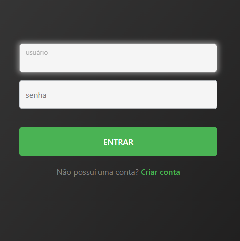
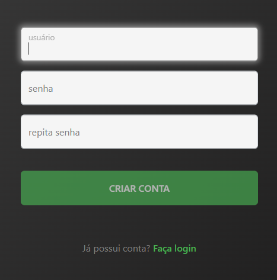
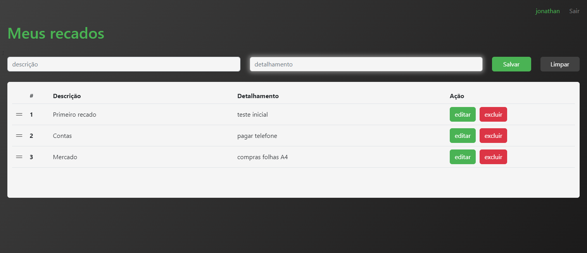
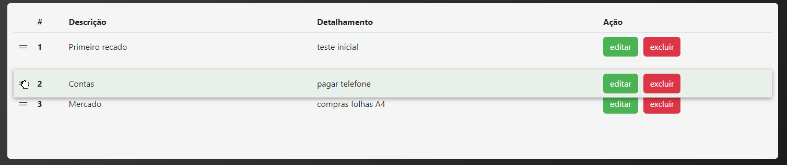

# GROWDEV - APP de Recados

<div align='center'>

</div>

Este repositório contém a Atividade Final do Módulo **Introdução à Programação** do curso de Full Stack Web Development.

<br>

O APP consiste em três páginas que permitem:
- Registro de usuários
- Login
- Exibição de recados 
- Adição de novo recado
- Edição de recado
- Exclusão de recado
- Reordenar recados

<br>

## It's LIVE

O app pode ser visualizado online no **[HEROKU](https://salty-refuge-11977.herokuapp.com/)**.

<br>

## Estilos

Com uso de [Sass](https://github.com/jtspinelli/growdev-ativ-final-intro-prog-web/blob/master/sass/main.scss) o tema padrão do Bootstrap foi modificado para criar um **tema personalizado** para a aplicação.

<br>

## Login e Registro

**Login** e **Registro** são gerenciados em páginas diferentes.

Os dados de Registro são salvos no ```LocalStorage``` para futura utilização.

<div align='center'>


</div>

<br>

O código ```Javascript``` da **página de Recados** valida as informações digitadas no formulário e só libera o botão de registro (criar conta) quando:
- Todos campos estão preenchidos
- Dois campos de senha conferem (informações digitadas são iguais)

Um campo de informação destaca em vermelho os passos que ainda faltam para a liberação do botão de registro (criar conta).


<div align='center'>


</div>

<br>

## Página principal

Uma vez logado no sistema, o usuário pode **visualizar**, **adicionar**, **editar** e **excluir** recados através da página principal.



<br>

## Reordenar recados

O usuário pode reordenar seus recados facilmente, utilizando os manipuladores no início de cada linha.

